# Recovering Deleted File on Storage Devices

If you have ever deleted a file from a storage device be it flash drive Hard drive and even the recent Solid drive (SSD) accidentally or not , at home or in the office do not fret, it can be ``recovered`` , with a tiny miniscule cave which is the success rate of the recovery depends on long ago said file was deleted.

Regardless let Get it,

### Tools
 1. Data recovery software (Recuva)
 2. Target storage device

#### Data Recovering software
They are many data recovering software out there feel free to search for them,but for this we are using ``Recuva`` which can be gotten from https://www.ccleaner.com/recuva/download and install it. 

#### Target Storage Device
This would the storage device that the file/s got deleted from , for this would be using a old flash drive i have been with for some time now , this would work for any storage device just be specific.I will then connect the flash drive to the system.
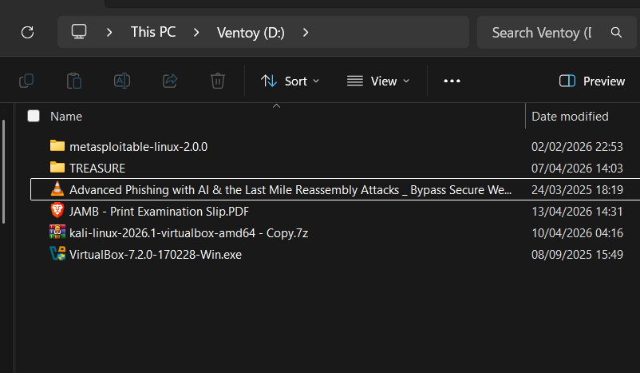

### Recovery Phase
  1. step 1 
     start the Recuva app 
     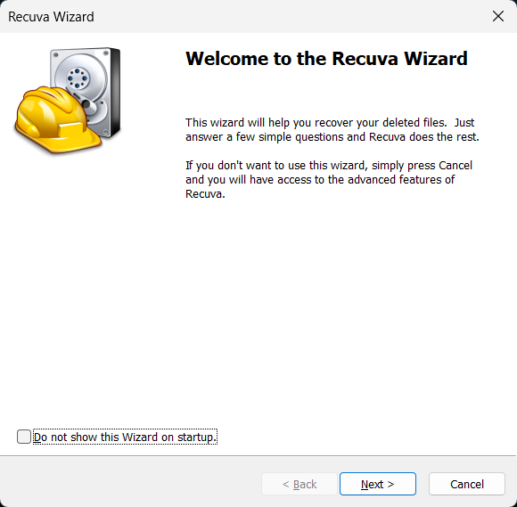
     then click on ``next``

     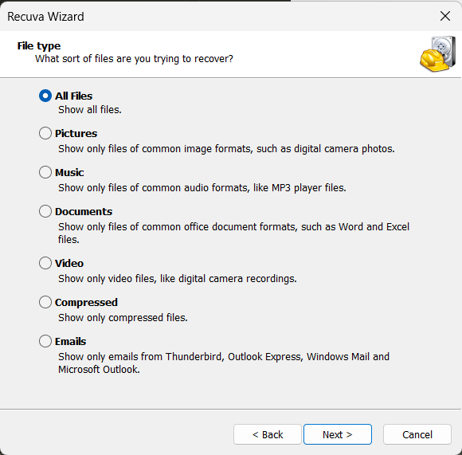
     In this stage you can pick the specific kind of file you are after , we will be selecting all file 
     then click on ``next``

     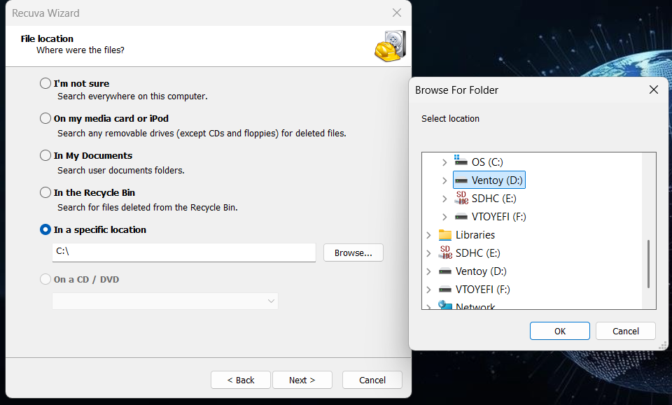
     In this stage we select the ``in a specific location`` then select the Drive , mine is D.
     then click on  ``okay`` and then ``next``

     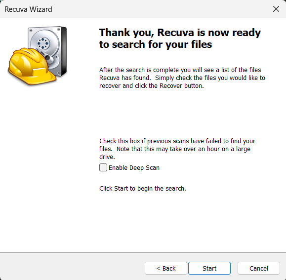
     the image above lets you select either deep scan or not . if want a deep scan fine but  it will take time , i just enter ``start``.

     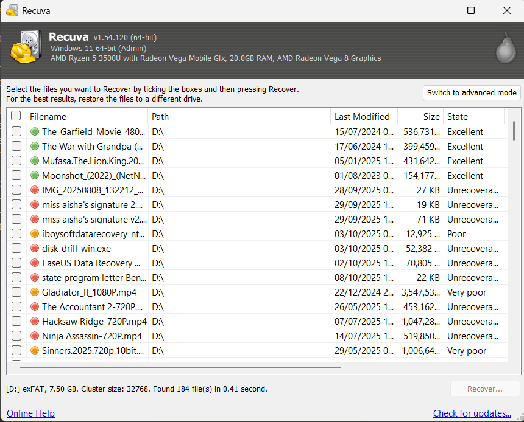
     fine if you compare the content of the image i added in the target device and this you can immediately tell the lack of movies as they have been deleted 

     Also looking closely you will see the ``state `` columns this tells you if the file target file can be recovered. 

     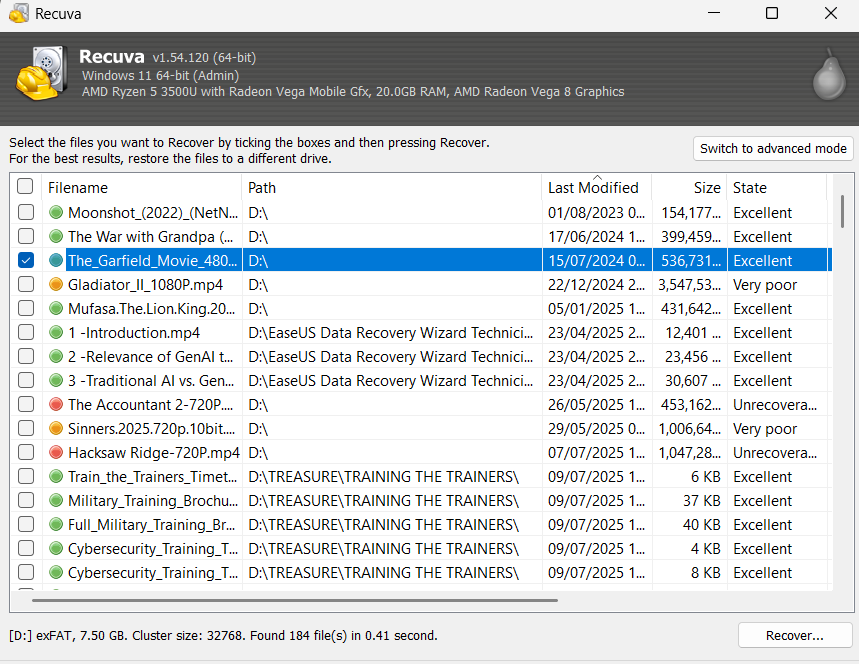

     for this , i will recovering the mufasa movie , click the checkbox then hit ``recover`` then select the destination of where the file should be kept ```Don`t place it back in the folder it is being recovered from``` choose another destination folder i chose the videos folders, then hit ``ok``

     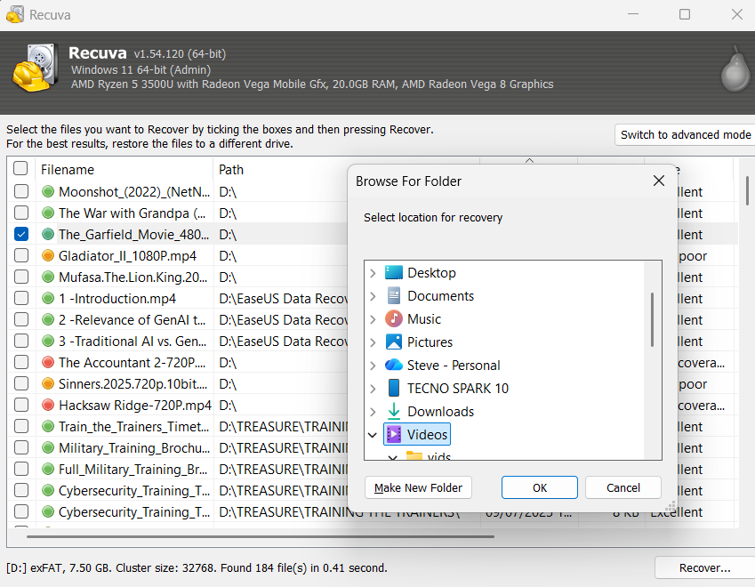

     Then the recovery begins depending on the size of the drive this can take way longer than this

     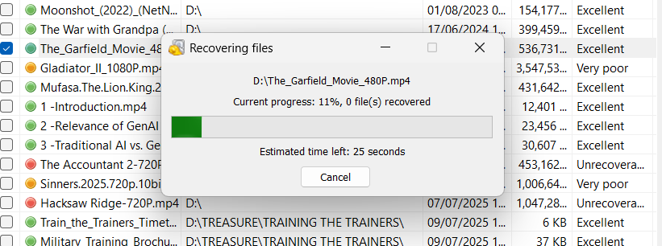
     
     See the file has been recovered.
     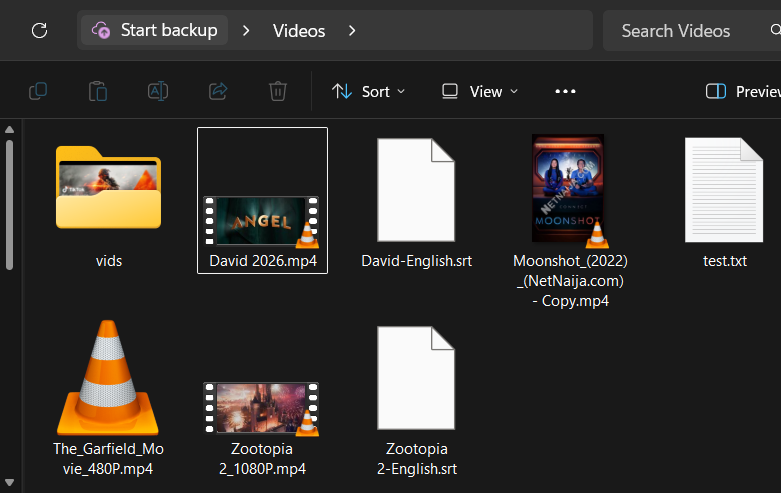
    
     Now lets check if it works.
     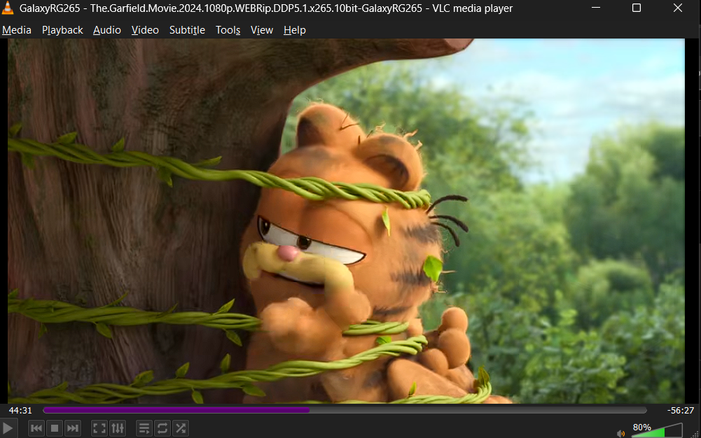

     There you have it , the file recovered and working , i will state that  the longer te file had been deleted the likelihood that it can`t be recovered 