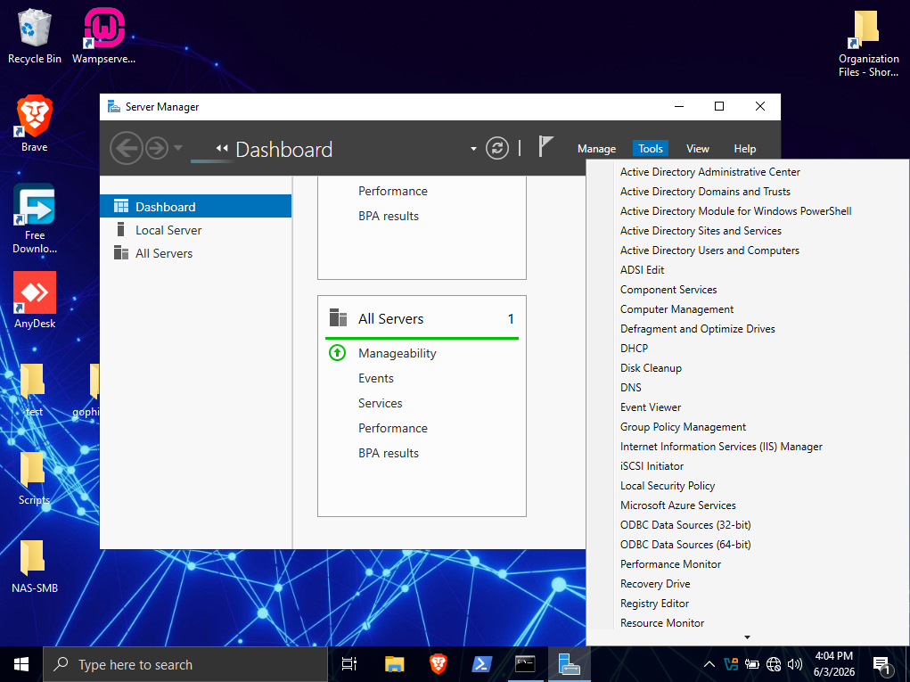

# Resetting A User Account Password

### Scenario
The new hire Mr. Johnny Test has forgotten his password (we've all been there 😂) and needs the IT department to help him reset his password.

Here's how to do it:

### Prerequisites
- Access to Active Directory Users and Computers
- Administrative credentials
- Knowledge of the user's department location

### Step 1: Opening Active Directory

- Click on **Tools** in the top right-hand corner
- Click on **Active Directory Users and Computers**

### Step 2: Locating the Right Account

- You can use the search option to find the user account, but if you already know the location, navigate directly
- **Important:** Verify you have the correct account to avoid affecting another user with the same name
- Navigate to the department where the account was created: **HUMAN RESOURCES > Users**

### Step 3: Resetting the Password

- Select the user account (Johnny Test) whose password you want to reset
- Right-click on the account
- Click on **"Reset Password"**
- Enter a new temporary password (e.g., `Resetme@Now`)
- Check the box **"User must change password at next logon"**
  - This ensures the user changes the temporary password when they log in again
- Click **OK**

### Completion

The password has been successfully reset. Provide the user with:
- The temporary password
- Instructions to change it upon first login
- Reminder to store the new password securely

---

**Tip:** The "User must change password at next logon" requirement is a security best practice that ensures users set their own secure password rather than keeping a temporary one (I hope it sticks with him this time 😂)
