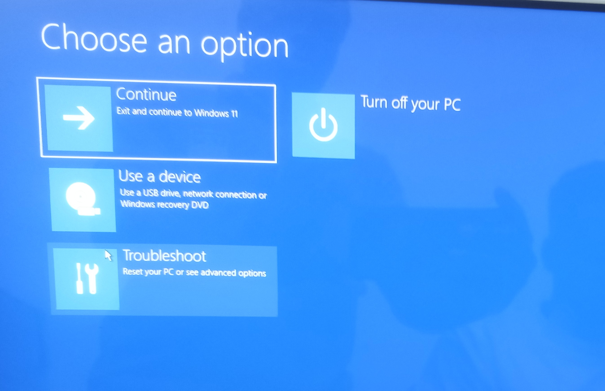
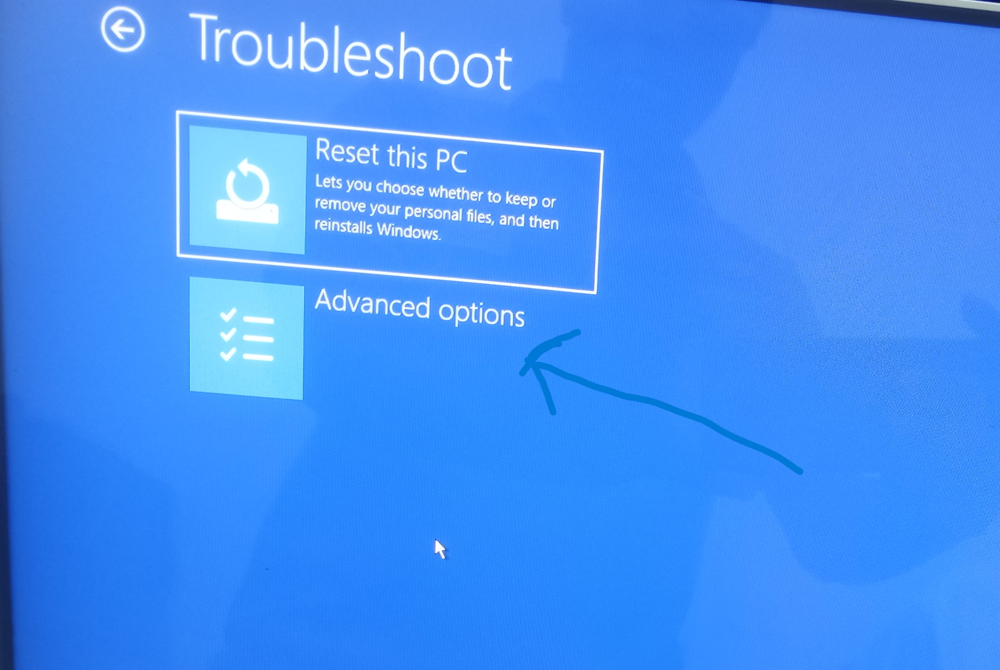
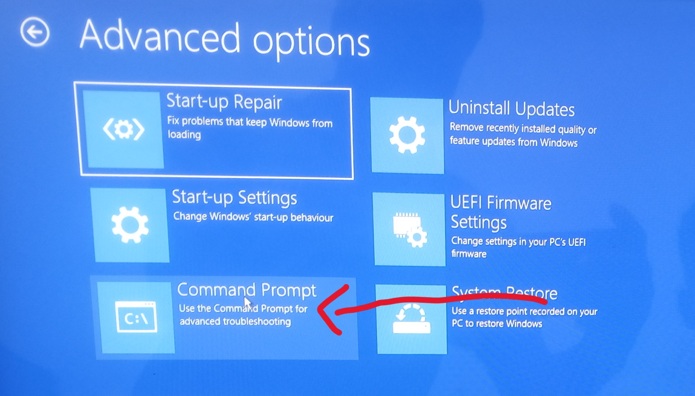
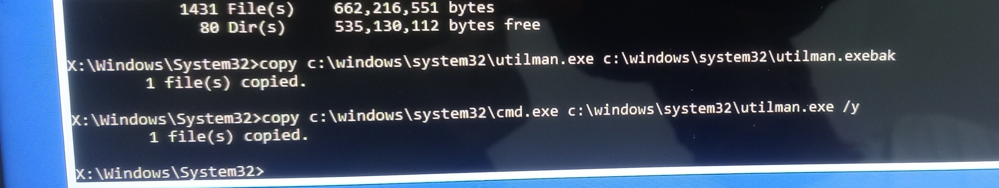

# Resetting Forgotten User password(Non-Domain based)

**Ticket No**: 0376

**Username** : James.Ethan 

**Department** : Accounting

**Time submitted** : 18/03/2026 11:30 AM

**Description** :
  ***Good day, i have my own PC here and i have forgotten the password because i can not seem to get it right, please i was told i would have to wipe my system before i can gain access,
  i can not lose the stuff in it, please is there a way you can help me reset the password.***

**Assigned to** : Eth-steve

### Resolving User-Ticket

1. on the login screen
    - while holding the shift button hit the power button then restart
  
  

2. Once the PC is back on you see this page (windows recovery environment)
    - Click on **Troubleshoot**
    - Click on **Advanced Options**



3. That will take you to the **Advanced options** page 
    - Click on  **Command Prompt**



4. Enter This command 
 ```
 copy c:\windows\system32\utilman.exe c:\windows\system32\utilman.exebak
 ```
 that commands create a copy of the utilman exe
 ```
 copy c:\windows\system32\cmd.exe c:\windows\system32\utilman.exe /y
 ```


5. close the command prompt
6. you be brought back to this page
   
  
  
7.  click on "Continue, Exit and continue to win 11"
 -  it should boot up and return back to the normal login page 
8. Click on the Accessibility icon (it looks like a tiny person) in the bottom right hand conner next to the power button 
   - it should open a command prompt 
   - then enter this command
  ```
 net localgroup administators
  ```

  this command  reveals account on the device, now take note of the username whose password whose forgot in this case it is Mr.Ethan james 
  - then run this command
  ```
  net user james *
  ```
  - it should prompt you to Enter and confirm a new password (use a dummy password so Mr.Ethan can change it later)
  - then you should see "Command completed successfully" 
9. Use the new password to log in
  - voila access to the system restored, Mr. Ethan now has access to his pc with out deleting any files or wiping his system
10. Before returning the system, we need to restore the accessibility 
  - repeat step 1 to 3 
  - then run this command 
    ```
     copy c:\windows\system32\utilman.exebak c:\windows\system32\utilman.exe /y 
    ```

## Ticket closed
 - Access to the System restored, file intact.

------
#### videos here : https://www.youtube.com/watch?v=ZK5mzXPlEHc
----- 
    

